<!-- SwiftCare LOGO -->
<br />
<div align="center">
  <a href="https://github.com/setiadyanwar/SwiftCare">
    
  </a>

  <h3 align="center">SwiftCare</h3>

  <p align="center">
    Donate with ease, and make the world a better place
    <br />
  </p>
</div>

<!-- ABOUT SwiftCare-->
## About SwiftCare
The challenge is to address inefficiencies and barriers in the current funding and social support landscape. Despite various charities and organizations, there is still a lack of a centralized and efficient platform that enables seamless, timely, and reliable giving while facilitating direct participation in social action.

Our application aims to address this challenge by providing a user-friendly platform that promotes collective well-being through sharing and supporting those in need. The purpose of this application is to streamline the donation process and make it more accurate, faster, and reliable. Users can easily donate money or start a fundraiser to support various social causes, and the intended recipient quickly receives their efforts.

<!-- Guide -->
## Guide to Run Project
### Precondition
[Android Studio](https://developer.android.com/studio) installed.

### Clone or download & extract the ZIP file, you can also fork this project.
```bash
git clone https://github.com/setiadyanwar/SwiftCare.git
```

### Open in Android Studio
1. Open Android Studio.
2. Select "Open" if you clone/download ZIP. Select the downloaded project directory.
3. If forked, then select "Get from VCS" and select the repository (make sure Android Studio is connected to your GitHub)
4. Wait until Android Studio completes the sync and builds the project.
6. Click the "Run" button or press `Shift + F10` to run the application on the virtual device or emulator.
   You can also use a physical device by turning on USB debugging on the device, and connecting the USB to the computer

You can also download the initial stage of our application via the following link [here](https://www.mediafire.com/file/qf3l794e22zgaps/app-debug.apk/file)
### :pushpin: Note
When running the application, Signing In with Google sometimes will cause an error because we need to register the SHA Key for each device into Firebase. We recommend creating a manual account via Sign Up.


<!-- Feature Screenshots -->
## Feature Screenshots
### Authentication
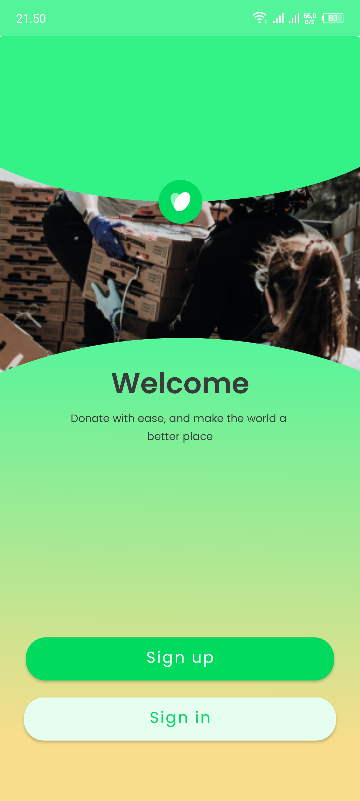 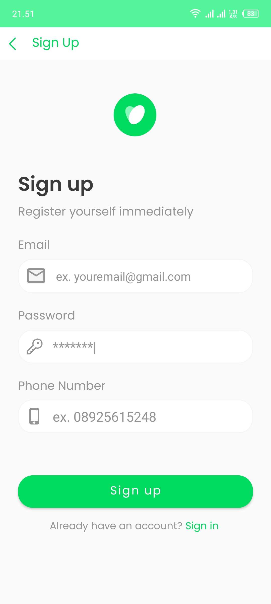 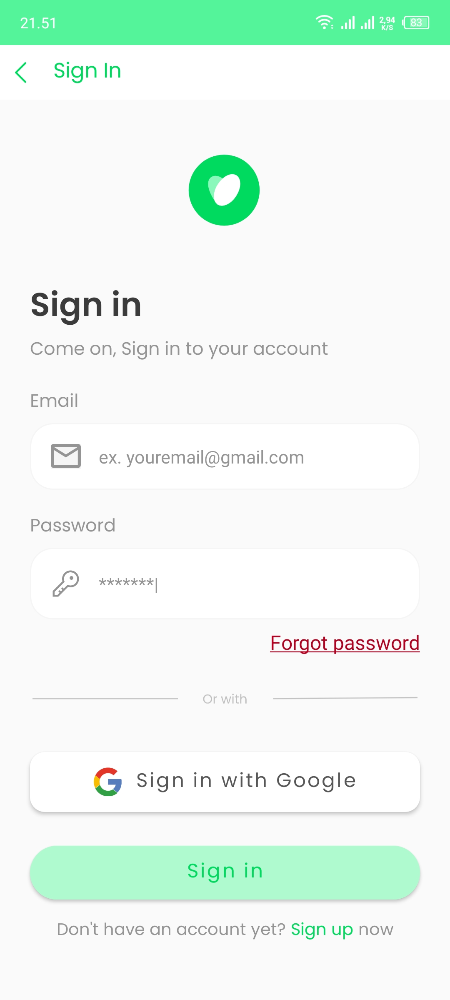


### Home Page
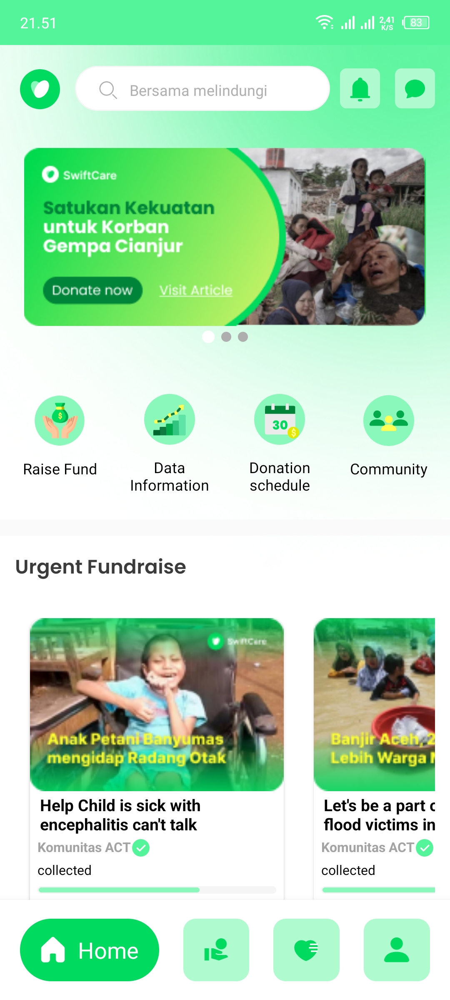

### Donation Page
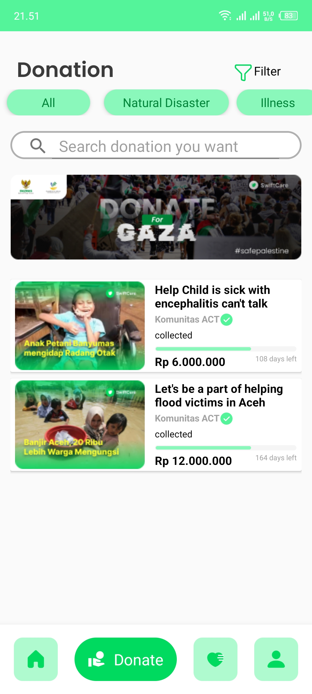 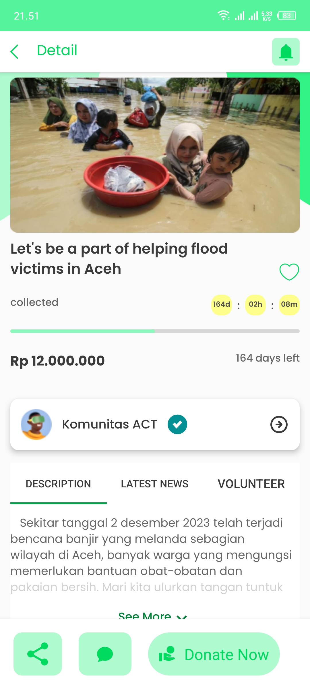 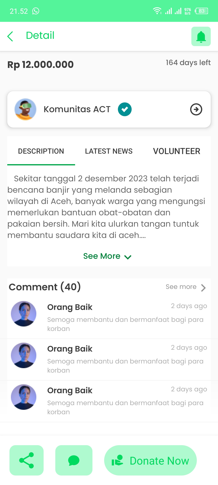 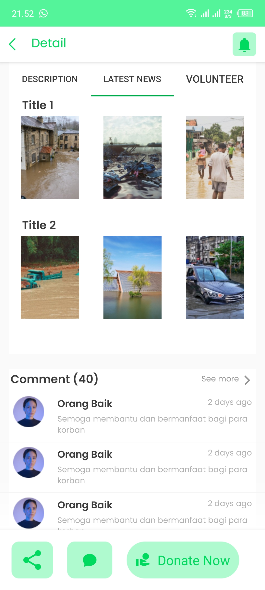 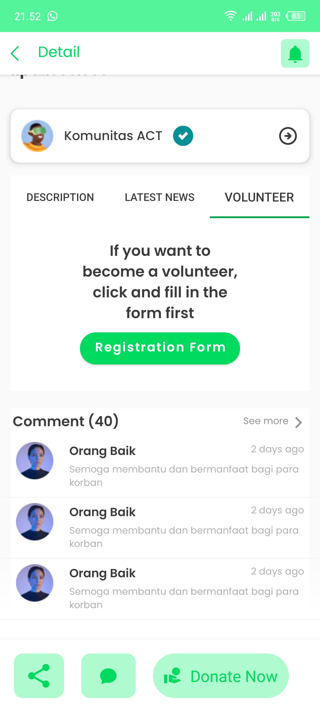 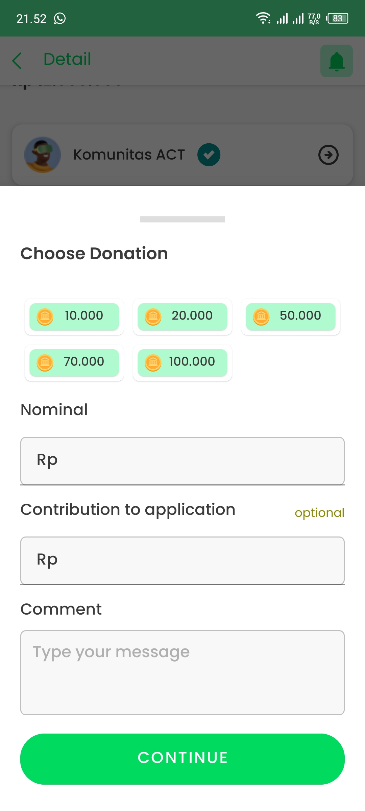 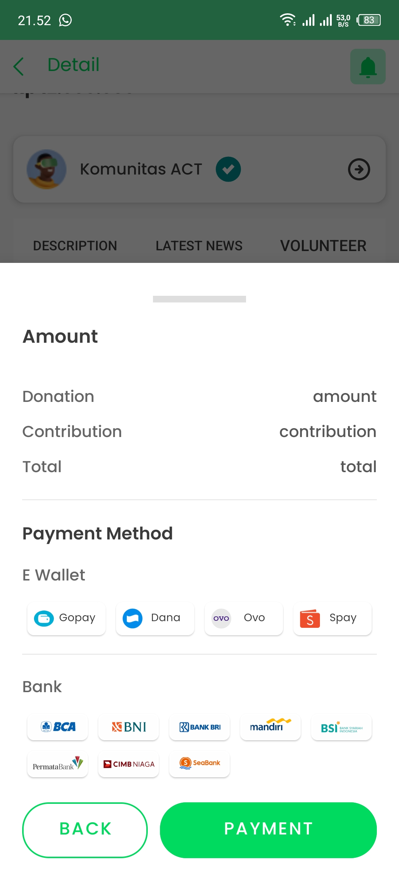

### LoveList
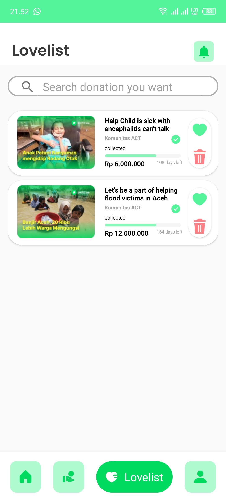

### Profile
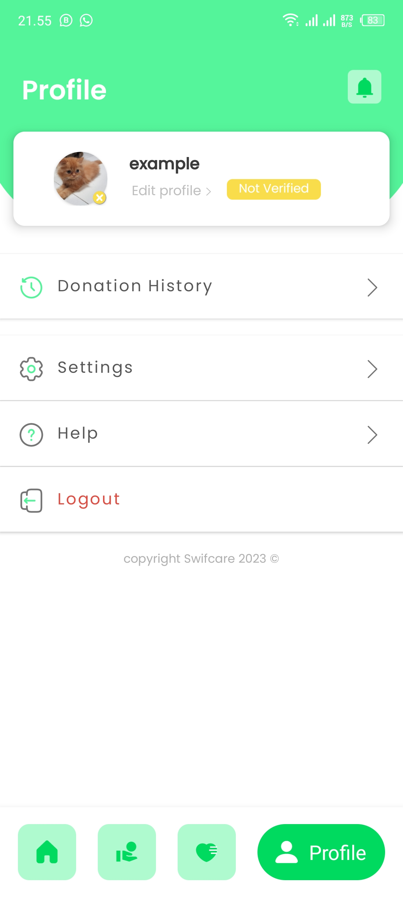

### Fundraise
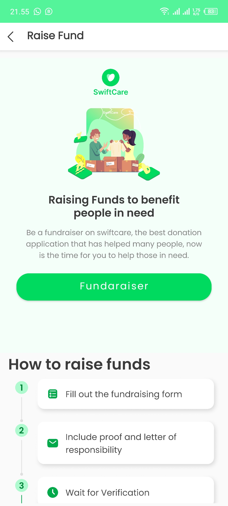

<!-- Progress -->
## Progress
- [x]  Authentication
- [x]  Homepage
- [x]  Donation
- [x]  LoveList
- [x]  Profile 
- [x]  RaiseFund
- [ ]  Data Information
- [ ]  Donation Schedule
- [ ]  Community


<!-- ABOUT Team-->
## SwiftCare Production Team
SwiftCare was built by the vocdev team consisting of:
* <a href="https://github.com/setiadyanwar">Setiady Ibrahim Anwar</a> - Hipster
* <a href="https://github.com/daffariz316">Daffarizqy Prastowiyono</a> - Hustler
* <a href="https://github.com/farhanfahrezyy">Muhammad Farhan Fahrezy</a> - Hacker
* <a href="https://github.com/FrzAdli">Adli Farizi</a> - Hacker
